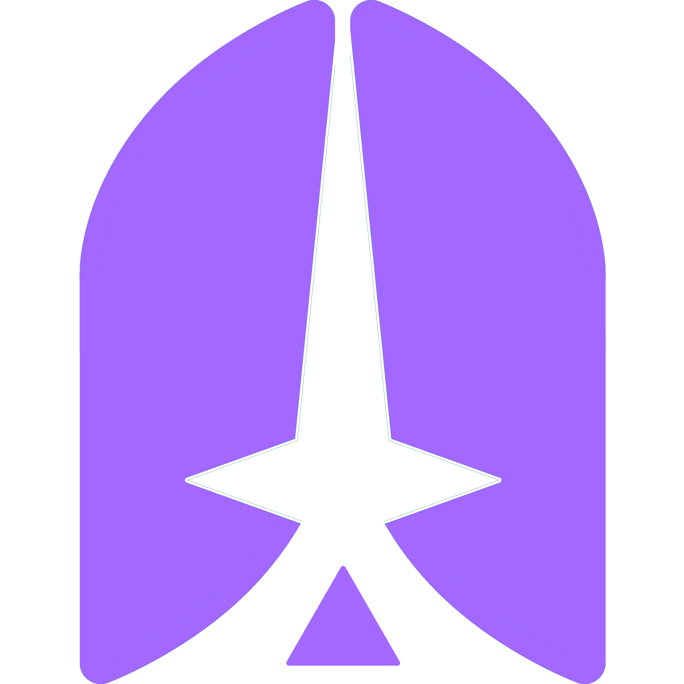

# Shipcamp

Shipcamp is a clone of Hipcamp where user can book campsites on ships. The live site is hosted on Heroku and can be found [here](https://ship-camp.herokuapp.com/).

## what it's for
Shipcamp is for demostration purposes and is meant to showcase my skills in Javascript, React, Redux, and Sequelize. This was my first time using React and Redux on the frontend in a full-stack project.

## structure
### back end
The back end is built in JavaScript and uses [Express](https://expressjs.com/) to manage the server and [Sequelize](https://sequelize.org/) with PostgreSQL to access and store the data. All routes are RESTful and serve JSON to the front end.

### front end
The front end is built in JavaScript and uses [React](https://reactjs.org/) to render HTML components, raw CSS for styling, and [Redux](https://redux.js.org/) to manage state.

## implementation details
<!--
### dynamic updates
### seeding
-->

### state
In `./frontend/src/index.js`, the app is imported from `./frontend/src/app.js` and wrapped in both the Redux provider from `react-redux` (to grant the app access to variables stored in the Redux store), and the browser router from `react-router-dom` (to enable simple front end routing). The Redux store is defined in `./frontend/src/store` and can be accessed in components using the `useSelector` hook and updated using the `useDispatch` hook.

## features
Take a look at the complete list of [features](https://github.com/breizeway/ship-camp/wiki/MVP-Features) in the wiki.

## database design
Take a look at the [database schema](https://github.com/breizeway/ship-camp/wiki/Database-Schema) in the wiki.

## logo
The logo was conceptualized and designed by me. It shows a launching space ship in the white space and the outline represents a boat shown from a top-down view.

  

## getting started
- clone the repository
- cd into the root directory
  - run `npm install` to install dependencies
- cd into the `backend` directory
  - define environment variables
    - run `touch .env`
    - use the `.env_example` to make sure the `.env` is set up correctly with environment variables
  - run `npm dotenv sequelize-cli db:create` to create the database with PostgreSQL
  - run `npm dotenv sequelize-cli db:migrate` to create the database tables
  - run `npm dotenv sequelize-cli db:seed:all` to optionally seed some data
  - run `npm run start` to start the server
- cd into the `frontend` directory
  - run `npm run start` to run the app in development mode
  - visit `http://localhost:3000` to view the app in the development environment

## Deployment
### Pushing to Heroku
Shipcamp is deployed to Heroku at https://ship-camp.herokuapp.com/. To deploy this app on your own:
- create you project at Heroku
- install Heroky Postgres as a resource
- add your environment variables
- make sure you are in the root of your repository directory and log into Heroku with `heroku login`
- add a new remote to your GitHub configuration with `heroku git:remote -a «your-app-name»`
- add and commit your changes
- push your changes to Heroku with `git push heroku`

### Updating the database
If you have made changes to your database and you want to push those changes to Heroku:
- run `heroku pg:reset --app heroku_app_name` to reset the database
- then run `heroku pg:push local_db_name DATABASE_URL --app heroku_app_name` to copy your database to Heroku

These commands should only be run during the development process because they will overwrite all data stored in the databe for the live site.
