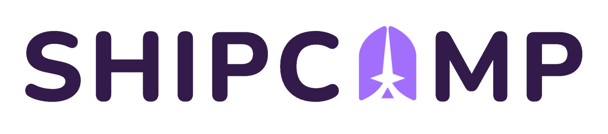

# Shipcamp

Shipcamp is a clone of Hipcamp where user can book campsites on ships.

## What it's for
Shipcamp is for demostration purposes and is meant to showcase my skills in Javascript, React, Redux, and Sequelize.

This was my first time using React and Redux on the frontend in a full-stack project. Using those technologies

## Logo

## Available Scripts

In the project directory, you can run:

### `npm start`

Runs the app in the development mode.\
Open [http://localhost:3000](http://localhost:3000) to view it in the browser.

The page will reload if you make edits.\
You will also see any lint errors in the console.

### `npm test`

Launches the test runner in the interactive watch mode.\
See the section about [running tests](https://facebook.github.io/create-react-app/docs/running-tests) for more information.

### `npm run build`

Builds the app for production to the `build` folder.\
It correctly bundles React in production mode and optimizes the build for the best performance.

The build is minified and the filenames include the hashes.\
Your app is ready to be deployed!

See the section about [deployment](https://facebook.github.io/create-react-app/docs/deployment) for more information.
